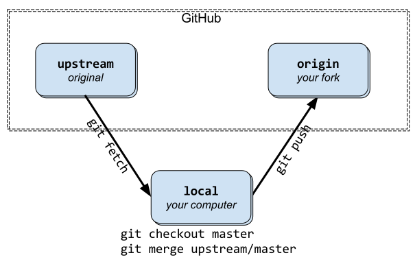

# git commit templates

```
# <type>: (If applied, this commit will...) <subject> (Max 50 char)
# |<----  Using a Maximum Of 50 Characters  ---->|


# Explain why this change is being made
# |<----   Try To Limit Each Line to a Maximum Of 72 Characters   ---->|

# Provide links or keys to any relevant tickets, articles or other resources
# Example: Github issue #23

# --- COMMIT END ---
# Type can be
#    feat     (new feature)
#    fix      (bug fix)
#    refactor (refactoring production code)
#    style    (formatting, missing semi colons, etc; no code change)
#    docs     (changes to documentation)
#    test     (adding or refactoring tests; no production code change)
#    chore    (updating grunt tasks etc; no production code change)
# --------------------
# Remember to
#    Capitalize the subject line
#    Use the imperative mood in the subject line
#    Do not end the subject line with a period
#    Separate subject from body with a blank line
#    Use the body to explain what and why vs. how
#    Can use multiple lines with "-" for bullet points in body
# --------------------
# For more information about this template, check out
# https://gist.github.com/adeekshith/cd4c95a064977cdc6c50
```

---

# git

## Syncing a fork



0. Add remote(call it "upstream") from original repository in your forked repository.
```
$ git remote add upstream https://github.com/whoever/whatever.git
```

1. Fetch the branches and their respective commits from the upstream repository. Commits to `master` will be stored in a local branch, `upstream/master`.
```
$ git fetch upstream
```

2. Check out your fork's local `master` branch.
```
$ git checkout master
```

3. Merge the changes from `upstream/master` into your local `master` branch. This brings your fork's `master` branch into sync with the upstream repository, without losing your local changes.
```
$ git merge upstream/master
```

## Branch & Merge

Command | Description
--------|-----
git branch | List branches (the asterisk denotes the current branch)
git branch -a	| List all branches (local and remote)
git branch [branch name] | Create a new branch
git branch -d [branch name] | Delete a branch
git push origin --delete [branch name] | Delete a remote branch
git checkout -b [branch name] | Create a new branch and switch to it
git checkout -b [branch name] origin/[branch name] | Clone a remote branch and switch to it
git checkout [branch name] | Switch to a branch
git checkout - | Switch to the branch last checked out
git checkout -- [file-name.txt] | Discard changes to a file
git merge [branch name]	| Merge a branch into the active branch
git merge [source branch] [target branch]	| Merge a branch into a target branch
git stash |	Stash changes in a dirty working directory
git stash clear |	Remove all stashed entries

---

# gitflow vs. git


## Initialize
gitflow | git
--------|-----
`git flow init` | `git init`
&nbsp; | `git commit --allow-empty -m "Initial commit"`
&nbsp; | `git checkout -b develop master`


## Connect to the remote repository
gitflow | git
--------|-----
_N/A_ | `git remote add origin git@github.com:MYACCOUNT/MYREPO`


## Features

### Create a feature branch
gitflow | git
--------|-----
`git flow feature start MYFEATURE` | `git checkout -b feature/MYFEATURE develop`

### Share a feature branch
gitflow | git
--------|-----
`git flow feature publish MYFEATURE` | `git checkout feature/MYFEATURE`
&nbsp; | `git push origin feature/MYFEATURE`

### Get latest for a feature branch
gitflow | git
--------|-----
`git flow feature pull origin MYFEATURE` | `git checkout feature/MYFEATURE`
&nbsp; | `git pull --rebase origin feature/MYFEATURE`

### Finalize a feature branch
gitflow | git
--------|-----
`git flow feature finish MYFEATURE` | `git checkout develop`
&nbsp; | `git merge --no-ff feature/MYFEATURE`
&nbsp; | `git branch -d feature/MYFEATURE`

### Push the merged feature branch
gitflow | git
--------|-----
_N/A_ | `git push origin develop`
&nbsp; | `git push origin :feature/MYFEATURE` _(if pushed)_


## Releases

### Create a release branch
gitflow | git
--------|-----
`git flow release start 1.2.0` | `git checkout -b release/1.2.0 develop`

### Share a release branch
gitflow | git
--------|-----
`git flow release publish 1.2.0` | `git checkout release/1.2.0`
&nbsp; | `git push origin release/1.2.0`

### Get latest for a release branch
gitflow | git
--------|-----
_N/A_ | `git checkout release/1.2.0`
&nbsp; | `git pull --rebase origin release/1.2.0`

### Finalize a release branch
gitflow | git
--------|-----
`git flow release finish 1.2.0` | `git checkout master`
&nbsp; | `git merge --no-ff release/1.2.0`
&nbsp; | `git tag -a 1.2.0`
&nbsp; | `git checkout develop`
&nbsp; | `git merge --no-ff release/1.2.0`
&nbsp; | `git branch -d release/1.2.0`

### Push the merged feature branch
gitflow | git
--------|-----
_N/A_ | `git push origin master`
&nbsp; | `git push origin develop`
&nbsp; | `git push origin --tags`
&nbsp; | `git push origin :release/1.2.0` _(if pushed)_


## Hotfixes

### Create a hotfix branch
gitflow | git
--------|-----
`git flow hotfix start 1.2.1 [commit]` | `git checkout -b hotfix/1.2.1 [commit]`

### Finalize a hotfix branch
gitflow | git
--------|-----
`git flow hotfix finish 1.2.1` | `git checkout master`
&nbsp; | `git merge --no-ff hotfix/1.2.1`
&nbsp; | `git tag -a 1.2.1`
&nbsp; | `git checkout develop`
&nbsp; | `git merge --no-ff hotfix/1.2.1`
&nbsp; | `git branch -d hotfix/1.2.1`

### Push the merged hotfix branch
gitflow | git
--------|-----
_N/A_ | `git push origin master`
&nbsp; | `git push origin develop`
&nbsp; | `git push origin --tags`
&nbsp; | `git push origin :hotfix/1.2.1` _(if pushed)_


## References
- http://nvie.com/posts/a-successful-git-branching-model/
- https://help.github.com/articles/using-pull-requests#shared-repository-model
- https://gist.github.com/JamesMGreene/cdd0ac49f90c987e45ac
- Personal experience
